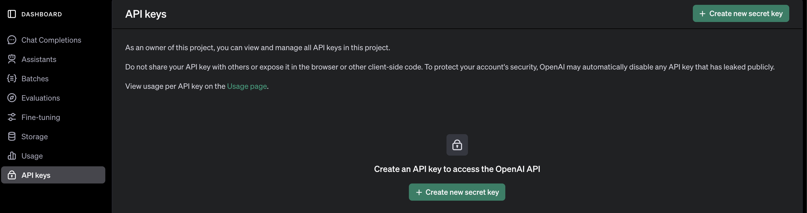
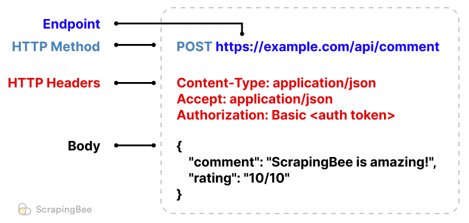

# PDF Question Helper: A Beginner's Project

Welcome to **PDF Question Helper**, a simple app that allows users to upload a PDF, extract its text, and ask questions about the document using ChatGPT! This project is designed to help beginners learn how to integrate front-end, back-end, and third-party APIs.

---

## ✨ Features

- Upload a PDF file to extract its text content.
- Ask ChatGPT questions about the PDF's content.
- Simple React frontend and Express backend setup.
- Integration with `pdf-parse` and OpenAI API.

---
## 🚀 Project Guide

### 1. Setup

This guide assumes you have basic familiarity with React and Javascript. If you need a refresher, check out the [React Quick Start](https://react.dev/learn). Before we get started with coding, we need to install a few dependencies. 

Node.js is a JavaScript runtime environment that allows developers to run JavaScript code on the server side or outside a web browser. It comes pre-packaged with npm, a package manager that allows developers to install open-source libraries and modules. You can install Node.js from [this website](https://nodejs.org/). 

After installation, open your terminal or command prompt and run:
```bash
node -v
npm -v
```

For this project, we also need an API key to communicate with the OpenAI API. An API key is a unique identifier used to authenticate requests made to an API (Application Programming Interface). We will provide the API key in your application or scripts when making requests to OpenAI's API.

Sign up for an account at [OpenAI](https://platform.openai.com/signup). Navigate to the API Keys section in your OpenAI dashboard and click Create New Secret Key to generate a new API key.



Copy the API key and save it securely. (You won't be able to see it again once you close the window.)

### 2. Primer: What is an API?

An API (Application Programming Interface) is a set of rules and tools that allow different software applications to communicate with each other. Think of it as a bridge that enables one application to request and receive data or functionality from another.

In simpler terms, APIs allow developers to access features or data from external services, without needing to know how those services work internally. For example:
- Social media APIs let you embed posts or retrieve user data.
- Weather APIs provide real-time weather updates.
- OpenAI’s API allows developers to use AI capabilities, such as ChatGPT, in their own apps.

When you use an API, you're essentially making a request to a server, and the server sends back a response. This is typically done over the internet using protocols like HTTP. Here’s the basic workflow:
1. **Request**: Your application sends a request to the API endpoint (a URL). This request might include parameters, such as what data you need or actions you want to perform.
2. **Authentication**: Many APIs require you to provide an API key to verify your identity.
3. **Response**: The server processes your request and sends back a response, usually in JSON format (a lightweight data format that’s easy to read and work with). It also returns a status code, which indicates whether the request was successful (e.g., `200 OK`) or if there was an error (e.g., `404 Not Found`).


#### Understanding REST APIs

A REST API (Representational State Transfer) is a widely used style for building APIs. It relies on standard web technologies like HTTP, making it simple and accessible for developers to use. REST APIs are often used for client-server communication.

With REST APIs, communication is organized around "resources." A resource is any object or piece of data that the API manages, such as a PDF document, a user profile, or a question. Each resource is identified by a URL, known as an endpoint.

You interact with these resources by performing actions, which are represented by HTTP methods. For example:
- If you want to retrieve information, you use the GET method.
- To send data or create something new, you use the POST method.
- Updating or modifying a resource typically uses PUT or PATCH.
- Deleting a resource involves the DELETE method.

REST APIs also often include parameters to customize the request. For instance, query parameters allow you to filter or sort results (e.g., `?search=pdf`), while data in the request body lets you send more complex information, like a question to analyze text.

An endpoint is a specific URL that identifies a resource or action within the API. It is like the address where you send your request to interact with a resource. For example:
- `https://api.example.com/documents` might represent all documents.
- `https://api.example.com/documents/123` could represent a specific document with an ID of `123`.

Endpoints often combine with HTTP methods to perform different actions:
- GET `/documents` retrieves all documents.
- POST `/documents` creates a new document.
- GET `/documents/123` retrieves a specific document with ID 123.
- DELETE `/documents/123` deletes the document with ID 123



When interacting with an endpoint, a request typically includes:
- The endpoint URL that specifies the resource (e.g., /documents).
- An HTTP method that defines the action (e.g., GET to retrieve data).
- Headers that provide metadata (e.g., an API key for authentication).
- Query parameters in the URL (e.g., ?search=pdf).
- Body parameters in JSON format for sending complex data.

In this project, we’ll use a REST API to send questions and context to the OpenAI API via HTTP POST requests. The API will analyze the PDF text and return a JSON response with the answers. Understanding these basics will help as we integrate the OpenAI API with our backend. Let’s move on to setting up the project!

### 3. Creating a New Project

Our project will be organized into two folders.  

```plaintext
pdf-question-helper/
├── frontend/       # React Frontend
└── backend/       # Express Backend
```

The frontend contains the user-facing interface, built with React. It handles:
- UI/UX design and layout.
- User interaction and event handling.
- Fetching and displaying data from the backend.

The backend contains the server-side code, built with Express. It handles our APIs to process requests from the frontend.

#### Frontend
`create-react-app` is a popular tool to bootstrap React applications. It sets up a new React project with all the essential configurations and tools pre-installed, so you can start coding immediately without hassle.

1. Create a React app
   ```bash
   npx create-react-app frontend
   ```
2. Navigate to the project folder:
   ```bash
   cd frontend
   ```
3. Install Axios for making API requests:
   ```bash
   npm install axios
   ```

4. Start the frontend:
   ```bash
   npm start
   ```

---

#### Backend

1. Navigate back to the root directory and create the server folder:
   ```bash
   mkdir backend && cd backend
   ```
2. Initialize a Node.js project:
   ```bash
   npm init -y
   ```
3. Install dependencies:
   ```bash
   npm install express multer pdf-parse openai
   ```
4. Create a file `index.js` and add the following code. 

   ```javascript
   // IMPORT LIBRARIES
   const express = require('express');
   const multer = require('multer'); // Multer is used to handle file uploads in Node.js.
   const pdfParse = require('pdf-parse'); // pdf-parse is a library to extract text from PDF files.
   const { OpenAI } = require('openai'); 

   // INITIALIZATION 
   const app = express();
   const upload = multer();
   const openai = new OpenAI('YOUR_OPENAI_API_KEY');

   app.use(express.json());

   // START SERVER
   app.listen(5001, () => console.log('Server running on http://localhost:5001'));
   // The server listens on port 5001 and logs a message when it's running.
   ```

5. Start the backend:
   ```bash
   node index.js
   ```

---

## 💡 How It Works

### 1. Upload PDF
When a user uploads a PDF file, the backend processes it with `pdf-parse` to extract the text content.

**Backend Code**:
```javascript
app.post('/upload', upload.single('file'), async (req, res) => {
    try {
        const data = await pdfParse(req.file.buffer);
        res.json({ text: data.text });
    } catch (error) {
        res.status(500).json({ error: 'Failed to parse PDF' });
    }
});
```

### 2. Ask a Question
The user asks a question about the PDF's content, which is sent to the OpenAI API to generate a response.

**Backend Code**:
```javascript
app.post('/ask', async (req, res) => {
    const { question, pdfText } = req.body;
    try {
        const stream = await openai.chat.completions.create({
            model: "gpt-4o-mini",
            messages: [{ role: "user", content: `${pdfText}\n\nQ: ${question}\nA:` }],
            store: true,
            stream: true,
        });

        let answer = '';
        for await (const chunk of stream) {
            answer += chunk.choices[0]?.delta?.content || "";
        }

        res.json({ answer });
    } catch (error) {
        res.status(500).json({ error: 'Failed to get response from OpenAI' });
    }
});
```

Enjoy building your project! 😊
